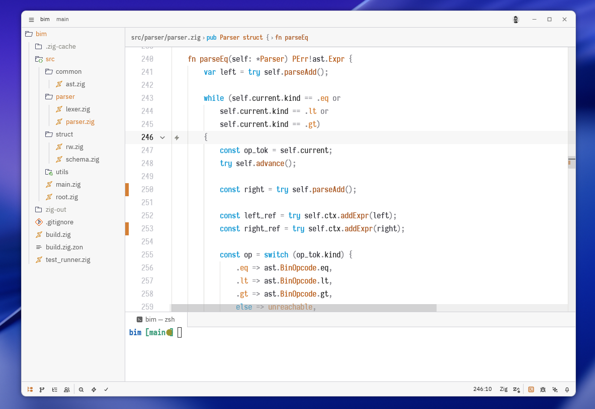
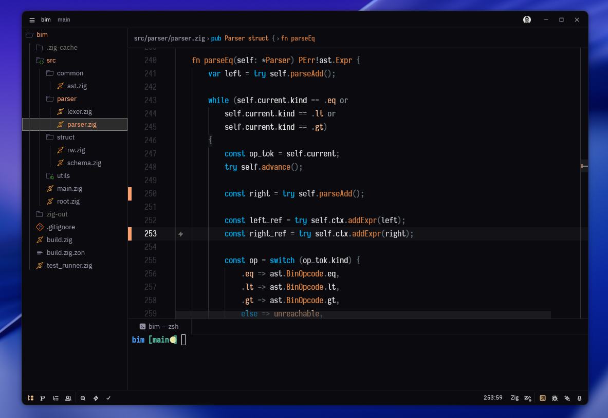

# Qubik
Minimal zed theme

## Preview
### Qubik Light

### Qubik Dark

## Installation
1. Copy `qubik.json` from themes directory to `~/.config/zed/themes/`
2. Open `Zed` and navigate to `Settings` -> `Theme` -> `Qubik`
